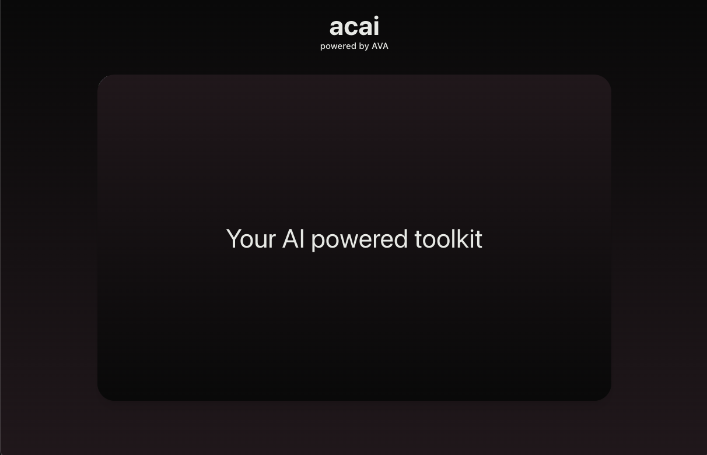
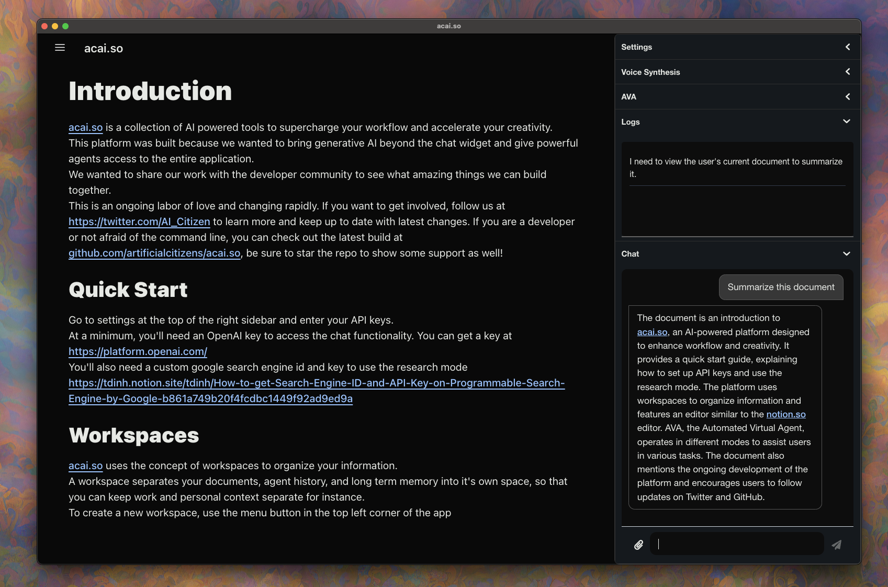

# ACAI



ACAI is a collection of AI powered tools to help you manage your digital world

Check out our quick start at [acai.so](https://www.acai.so/docs/introduction) to learn more



## Technology Stack

- [React](https://reactjs.org/) - A JavaScript library for building user interfaces
- [Tailwind CSS](https://tailwindcss.com/) - A utility-first CSS framework for rapid UI development
- [TypeScript](https://www.typescriptlang.org/) - A typed superset of JavaScript that adds optional static types
- [Vite](https://vitejs.dev/) - A build tool and development server that focuses on speed and simplicity
- [LangchainJS](https://js.langchain.com/docs/) - Compose language models into chains

## Getting Started

Clone this repo and install the dependencies:

```bash
git clone
cd ava
pnpm install
pnpm run dev
```

Open [http://localhost:5173](http://localhost:5173) to view it in the browser.

## Contributing

We are currently looking for contributions in web development, quality assurance, and devops as we are gearing up to build the open source community.
Please see our [Contributing Guide](CONTRIBUTING.md) for more details.

## License

This project is licensed under the MIT License - see the [LICENSE.md](LICENSE.md) file for details
